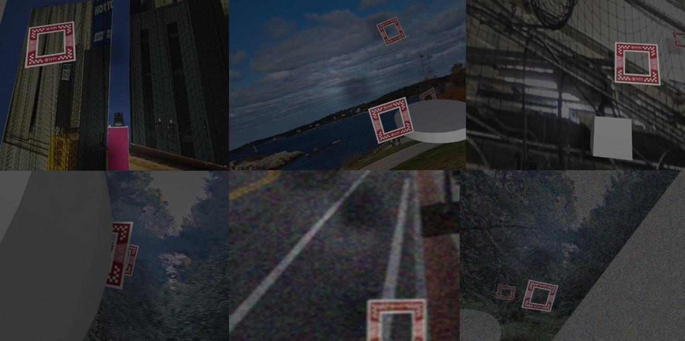

# Object Segmentation for Drone Navigation Assistance Using Synthetic Data

In this project, we designed and implemented a deep neural network capable of **segmenting drone racing windows** to enhance **visual navigation**. It was done as a part of the "Deep Learning for Perception" course.

This project composed of three parts:
1) Synthetic Dataset Generation
2) Semantic Segmentation
3) Instance Segmentation

# Synthetic Dataset Generation
The main goal was to create a synthetic dataset to train a segmentation network capable of generalizing to real-world scenarios. Using Domain Randomization in Blender 3D, we generated around 5,000 realistic RGB images of PeAR racing windows from various views and backgrounds, along with their corresponding segmentation masks. Since segmentation networks require large datasets for effective training, and rendering solely in Blender is computationally expensive, we applied data augmentation techniques from the TorchVision and Albumentations libraries, ultimately expanding the dataset to about 60,000 training images for improved sim-to-real generalization.

   
