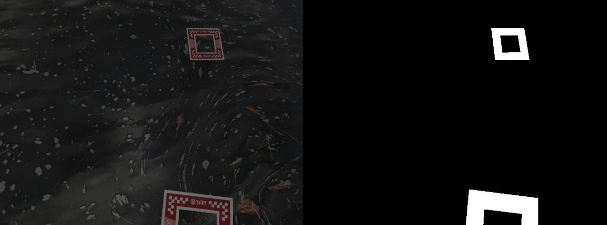
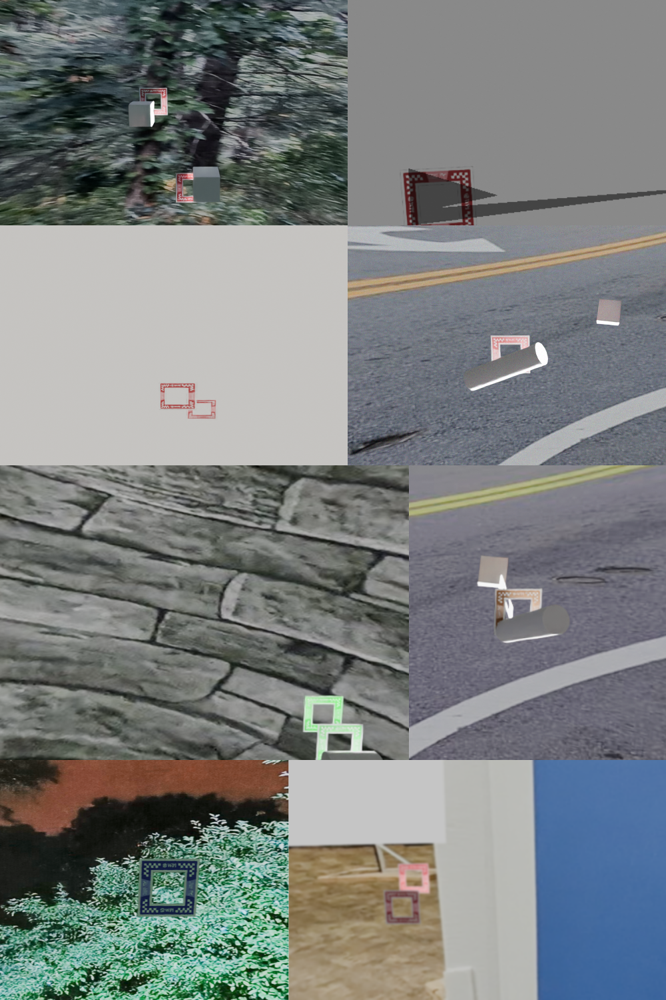
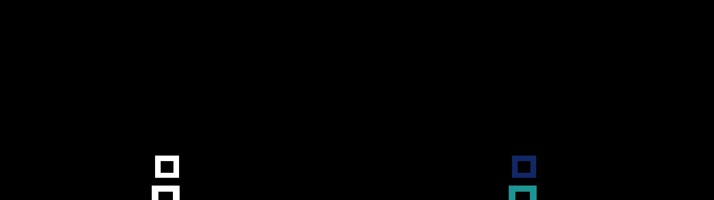

# Object Segmentation for Drone Navigation Assistance Using Synthetic Data

In this project, we designed and implemented a deep neural network capable of **segmenting drone racing windows** to enhance **visual navigation**. It was done as a part of the "Deep Learning for Perception" course.

This project composed of three parts:
1) Synthetic Dataset Generation
2) Semantic Segmentation
3) Instance Segmentation

# Synthetic Dataset Generation
The main goal was to create a synthetic dataset to train a segmentation network capable of generalizing to real-world scenarios. Using Domain Randomization in Blender 3D, we generated around 5,000 realistic RGB images of PeAR racing windows from various views and backgrounds, along with their corresponding segmentation masks. Since segmentation networks require large datasets for effective training, and rendering solely in Blender is computationally expensive, we applied data augmentation techniques from the TorchVision and Albumentations libraries, ultimately expanding the dataset to about 60,000 training images for improved sim-to-real generalization.

Sample Training Sample - RGB Image and Groundtruth Segmentation Mask

                          

# Data Augmentation

To make our segmentation network more robust to real-world conditions, we applied several augmentations, including camera tilt, object occlusion, background changes, lighting variations, noise, blur, and color alterations. These color adjustments involved techniques like random brightness/contrast, channel shuffling, and random shadow effects.

# Semantic Segmentation 

The semantic segmentation model uses a U-Net architecture with an encoder-decoder design. The encoder consists of convolutional blocks, similar to those found in ResNet18. The model was trained on the "Turing-cluster" supercomputer and analyzed using the Weights and Biases (wandb) framework. We deploy the BCE Logits Loss Function for our network considering its a binary classification model where we isolate the window frames from the background.

Segmentation results:

       

# Instance Segmentation
We conducted instance segmentation to identify and label individual objects, specifically multiple window frames. A key technique used was the Connected Components algorithm, which detects and labels regions of similar pixels based on connectivity. While effective for segmenting distinct objects in binary masks, it struggled with overlapping instances. 

